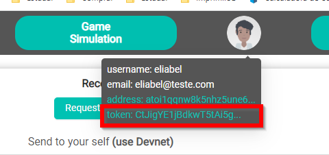

# How to use this project as external API

This project was developed to be used only in the virtual world (simulator) created in the Unity software and can be obtained through the repository[Cariota Simulator](https://github.com/ebarretodev/cariota.org.simulator).

As a way of testing and integrating with the real world, there is the possibility of making transactions using the external API will be described in this section.

## Rules for using the API
- All endpoints are available for access in the path https://cariota.org/api/v1/
- User will need to be registered in the API and have their own token and the address of the user that must be sent. The token can be obtained through the website interface as shown in the following image.

- Transactions will only be allowed if the token is valid and registered on the server.
- Target user must also be registered on the server. Otherwise there will be no transaction.

## Available routes

There are 3 routes available for sending values.

- [Balance](balance.md)
- [Buy Iotas](buy.md)
- [Send Values](sendValue.md)