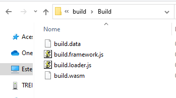

# How to copy this project included Unity models

To recreate the entire project you must have knowlegde about the Unity Software and C# language, besides React lib and Firebase application.

## Summary
1. [Create Firebase Project](#create-firebase-project)
2. [Copy Front End project](#copy-front-end-project)
3. [Copy Unity Simulator project](#copy-unity-simulator-project)
5. [Build the unity project](#build-the-unity-project)
6. [Testing and deploy the react project](#testing-and-deploy-the-react-project)

## Create Firebase Project
The first step is create a firebase project on https://firebase.google.com/.

After creation enable the following resources:
1. **Authentication**
2. **Firestore**
3. **Hosting**
4. **Functions** (for this one you must setup the project to Blaze Plan and you need to have a credit card)

Remember to copy the firebaseConfig data to setup on enviroment files further.

## Copy Front End project
On your directory clone the repository of the project.

```sh
git clone https://github.com/ebarretodev/cariota.org.frontend
```

Remove `.sample` from the name of the files `.env.development.local.sample` and `.env.production.local.sample`.

On same files edit then and insert the values from firebaseConfig data and URLs to access the API project.

## Copy Unity Simulator project
On your directory clone the repository of the project.

```sh
git clone https://github.com/ebarretodev/cariota.org.simulator
```

After, open up the project using the Unity software. For perfect use you must setup the API URL on following file:
```sh
~\Assets\Scripts\Scene1\GameConnectionsController.cs
...
// RestAPI requests
    // Uncoment the following line for access the local API server
    // private const string API_SITE = "YOUR_LOCAL_API_SERVER";
    // Uncoment the following line for access the remote API server
    private const string API_SITE = "YOUR_API_URL_SERVER";
...
```

## Build the unity project
Now you need to build the project, at this moment will be not possible to test. You only be able to test on Frontend project emulator.

On menu *File>Buil and Run* select (1)WebGL and click on button (2) Build:


After the build, files will be save on directory *~/cariota.org.simulator/build/Build*




Copy this files and past on the directory *~/cariota.org.simulator/public/build/*

## Testing and deploy the react project
This is the final step, now you be able to test the project and deploy to Firebase hosting.

### Testing
For test the project you must run on two command line the followings commands:
1. Run the Local API Simulator:
```sh
npm run functions
```
2. Run the Frontend Web APP:
```sh
npm start
```

Now you can use the project on http://localhost:5000

### Deploy
> Remember to register this project using the Firebase CLI. If you don't login on, it will be prompt a error running the following command.

For deploy the project, there is a script prepare for this, only run the command:
```sh
npm run deploy
```
